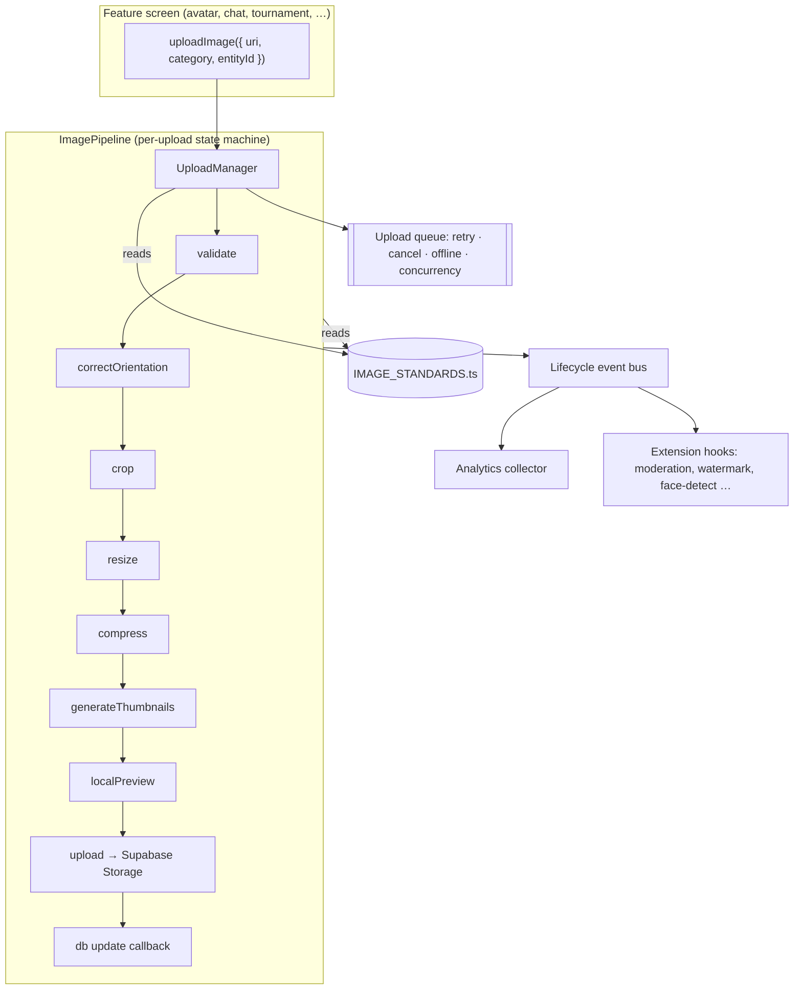

# ImagePipeline — Final Technical Specification

> Status: **Approved for implementation planning** · Phase 2 spec · No implementation code in this document.
> Target: Expo SDK 54 / React Native 0.81.5 (`apps/mobile`) + Supabase Storage.
> This document is the **single source of truth** for all image uploads in the application.

## Guiding principles (non-negotiable)

1. **One pipeline for every image.** No feature uploads an image any other way.
2. **Zero duplicated upload logic.** The six-plus current upload sites collapse to one service.
3. **Zero compression/crop/dimension logic inside feature screens.**
4. **Developers specify only the category** (+ uri, + entity id). The pipeline decides everything else.
5. **Open for extension, closed for modification.** New behavior is added as steps/subscribers/config, never by editing callers.

---

## 1. Final architecture



**Layering (dependency direction points downward — upper layers never import lower internals):**

| Layer | Responsibility | Knows about |
|---|---|---|
| **Feature screens** | Call `uploadImage`, render optimistic preview, subscribe to state | category name only |
| **Public API** (`imagePipeline.ts`) | Facade — validate inputs, dispatch to UploadManager | categories, event types |
| **UploadManager** | Queue, retries, cancellation, offline, concurrency, background | pipeline, config |
| **Pipeline steps** | validate → … → upload, each pure and swappable | config, current image buffer |
| **IMAGE_STANDARDS** | All rules for all categories | nothing (pure data) |
| **Adapters** | expo-image-manipulator, expo-file-system, Supabase client | native/SDK APIs |

The **config and the adapters are the only two places** that change when you tune standards or swap a native library. Callers never do.

---

## 2. Folder structure

```
apps/mobile/src/lib/media/
  index.ts                      # re-exports the public API only
  imagePipeline.ts              # PUBLIC API facade (uploadImage / uploadImages)
  IMAGE_STANDARDS.ts            # the one config — every rule for every category
  types.ts                      # ImageCategory, UploadResult, events, state

  uploadManager.ts              # queue, retry, cancel, offline, concurrency, background
  eventBus.ts                   # typed pub/sub for lifecycle events

  steps/
    validate.ts                 # size, MIME, magic-byte, dimension sanity
    orientation.ts              # bake EXIF rotation, strip metadata
    crop.ts                     # ratio crop OR passthrough (per config)
    resize.ts                   # long-edge cap (per config)
    compress.ts                 # quality + format encode (per config)
    thumbnails.ts               # generate configured thumbnail sizes
    upload.ts                   # FormData → Supabase (RN-correct path)

  adapters/
    manipulator.ts              # wraps expo-image-manipulator (only file that imports it)
    storage.ts                  # wraps supabase.storage (only file that imports it)
    filesystem.ts               # wraps expo-file-system

  analytics/
    collector.ts                # subscribes to the bus, records metrics

  __tests__/
```

**Rule:** anything outside `lib/media` imports **only** from `lib/media` (the barrel). `expo-image-manipulator` and `supabase.storage.upload` appear in exactly one file each.

---

## 3. Public API specification

The entire surface a feature developer touches. (Type signatures below are **specification**, not implementation.)

```ts
type ImageCategory =
  | 'avatar' | 'chat' | 'tournamentCover'
  | 'facility' | 'marketplace' | 'story';   // 'ad', 'video' reserved

interface UploadRequest {
  uri: string;              // local file:// from expo-image-picker
  category: ImageCategory;  // the ONLY decision the developer makes
  entityId: string;         // owning entity (userId, tournamentId, listingId…)
  // optional escape hatches, rarely used:
  ownerId?: string;         // defaults to current auth user
  metadata?: Record<string, string | number>;  // attached to analytics only
  signal?: AbortSignal;     // cancellation
}

interface UploadResult {
  url: string;                       // full-size public URL
  thumbnailUrl?: string;             // if the category defines thumbnails
  variants?: Record<string, string>; // future: server-generated sizes (map is empty in v1)
  width: number;
  height: number;
  bytes: number;
  path: string;                      // storage path (for later delete/replace)
}

// The whole API:
function uploadImage(req: UploadRequest): UploadHandle;
function uploadImages(reqs: UploadRequest[]): UploadHandle[]; // galleries, concurrency-capped

interface UploadHandle {
  id: string;
  promise: Promise<UploadResult>;    // await for the final URL
  cancel(): void;
  subscribe(cb: (state: UploadState) => void): () => void; // optimistic UI
}

type UploadState =
  | { phase: 'queued' }
  | { phase: 'processing'; step: PipelineStep }
  | { phase: 'uploading'; progress?: number }   // progress present only with TUS (roadmap)
  | { phase: 'done'; result: UploadResult }
  | { phase: 'error'; error: UploadError; retryable: boolean };
```

**Replace / delete** (also part of the standard so no screen calls `storage.remove` directly):

```ts
function replaceImage(req: UploadRequest & { previousPath?: string }): UploadHandle;
// uploads new immutable object, then deletes previousPath on success
function deleteImage(path: string): Promise<void>;
```

A feature developer never sees: bucket names, dimensions, quality, MIME, filenames, cache headers, FormData, or the Supabase client.

---

## 4. Image standards configuration (`IMAGE_STANDARDS.ts`)

The pipeline reads **only** from here. Shape (spec):

```ts
interface ThumbnailSpec { name: string; maxDim: number; quality: number; }

interface CategoryStandard {
  bucket: string;
  folder: (ctx: { ownerId: string; entityId: string }) => string; // e.g. `${ownerId}/${entityId}`
  filename: 'uuid' | 'timestamp-uuid';       // always immutable — never a fixed name
  crop: 'square' | '16:9' | '9:16' | 'none' | 'configurable';
  aspectRatio?: number;                       // enforced only when crop != 'none'
  maxDimension: number;                       // long-edge cap, px
  quality: number;                            // 0..1
  format: 'jpeg' | 'webp';                    // 'webp' gated on SDK-54 verification
  thumbnails: ThumbnailSpec[];                // [] = none
  cacheControl: number;                       // seconds; default 31536000 (1yr, immutable)
  maxUploadBytes: number;                     // client hard-gate before processing
  allowedMime: string[];                      // magic-byte checked, not extension
}
```

### The committed v1 table

| Category | bucket | folder | crop | ratio | maxDim | quality | format | thumbnails | cacheControl | maxUpload | allowedMime |
|---|---|---|---|---|---|---|---|---|---|---|---|
| `avatar` | `avatars` | `{ownerId}` | **square** | 1:1 | 1024 | 0.80 | jpeg | [128px] | 1yr | 15 MB | jpeg,png,heic,webp |
| `chat` | `message-attachments` | `{ownerId}/{entityId}` | none | — | 1600 | 0.70 | jpeg | [] | 1yr | 25 MB | jpeg,png,heic,webp |
| `tournamentCover` | `tournament-covers` | `{ownerId}/{entityId}` | **16:9** | 1.778 | 1920 | 0.85 | jpeg | [400px] | 1yr | 25 MB | jpeg,png,heic,webp |
| `facility` | `group-photos`¹ | `{ownerId}/{entityId}` | **none** | — | 1600 | 0.75 | jpeg | [400px] | 1yr | 25 MB | jpeg,png,heic,webp |
| `marketplace` | `marketplace`² | `{ownerId}/{entityId}` | **configurable** | caller/none | 1600 | 0.80 | jpeg | [400px] | 1yr | 25 MB | jpeg,png,heic,webp |
| `story` | `stories`² | `{ownerId}` | **9:16** | 0.5625 | 1920 | 0.75 | jpeg | [] | 1yr | 25 MB | jpeg,png,heic,webp |

¹ Reuse existing bucket or create a dedicated `facilities` bucket — decision D8. ² New buckets required (decision D8).

**Every bucket must also enforce `file_size_limit` and `allowed_mime_types` server-side** — the config's `maxUploadBytes`/`allowedMime` are the client mirror, not the enforcement.

---

## 5. Cropping standard

**When to crop (destructive, fixed ratio):** only where layout guarantees matter and the subject is predictable.

| Category | Behavior | Rationale |
|---|---|---|
| avatar | Square center-crop → 1:1 | Circular/square frames everywhere; predictable |
| tournamentCover | 16:9 crop | Hero banner slot is fixed ratio |
| story | 9:16 crop | Full-screen vertical canvas |
| marketplace | Configurable — caller may request a ratio, else preserve | Products vary; galleries sometimes want uniform tiles |
| facility | **Preserve** aspect ratio | Real-world venue photos; cropping loses context |
| chat | **Preserve** aspect ratio | User intent is the whole image |

**When crop occurs in the pipeline:** *after* orientation correction, *before* resize. Center-crop by default in v1; smart/face-aware centering is an extension point (§7), not a v1 feature. Cropping is **never silent for `crop:'none'`** categories — those pass through untouched except resize/compress.

---

## 6. Upload lifecycle

```
select → validate → correctOrientation → crop → resize → compress
       → generateThumbnails → generateLocalPreview → upload → updateDatabase
       → refreshUI → cleanup
```

| Stage | Does | Emits |
|---|---|---|
| select | (caller) picks via expo-image-picker | — |
| validate | size gate, magic-byte MIME, dimension sanity | `beforeValidation`, `validationFailed` |
| correctOrientation | bake EXIF rotation, **strip all metadata (incl. GPS)** | — |
| crop | per category (§5) | — |
| resize | long-edge cap | — |
| compress | quality + format encode | `beforeCompression`, `afterCompression` |
| generateThumbnails | on-device extra passes per config | — |
| generateLocalPreview | expose local uri for optimistic UI | `previewReady` |
| upload | FormData → Supabase, immutable path | `beforeUpload`, `uploadProgress`, `uploadCompleted`, `uploadFailed` |
| updateDatabase | caller-supplied callback / returned URL | — |
| refreshUI | swap preview → remote URL | — |
| cleanup | delete temp files; on replace, delete previous object | `cleanupCompleted` |

### Lifecycle events (typed bus)

`beforeValidation` · `validationFailed` · `beforeCompression` · `afterCompression` · `previewReady` · `beforeUpload` · `uploadProgress` · `uploadCompleted` · `uploadFailed` · `cleanupCompleted`

Each event carries `{ uploadId, category, entityId, timestamp, payload }`. Subscribers (analytics, moderation, watermarking) attach **without modifying the pipeline** — this is the "closed for modification" mechanism.

> Note on `uploadProgress`: `supabase-js .upload()` exposes **no byte-progress on RN**. v1 emits coarse phases (`queued→processing→uploading→done`). True byte-level `progress` requires resumable **TUS** uploads — see roadmap Phase 4.

---

## 7. Upload Manager responsibilities

No screen manages uploads directly. The manager owns:

- **Queue** — FIFO with priority (interactive avatar/chat > background gallery).
- **Concurrency limit** — default **3** simultaneous uploads; galleries respect it.
- **Retries** — exponential backoff (1s/4s/16s, max 3) on network/5xx **only**; never on 4xx/RLS.
- **Cancellation** — `AbortSignal` cancels processing and upload; partial remote object is deleted.
- **Offline** — persist pending uploads (local uri + request) to disk; flush on connectivity regain (NetInfo).
- **Background** — upload survives screen unmount and (roadmap) app backgrounding via TUS/background task.
- **Deduplication** — same uri+category+entity in-flight collapses to one handle.

State is observable so multiple screens can reflect the same upload.

---

## 8. Security model

| Control | Rule |
|---|---|
| **Server enforcement** | Every bucket sets `file_size_limit` + `allowed_mime_types`. This is the real gate; client checks are advisory. |
| **Magic-byte validation** | MIME determined by file signature, **not extension** (current code trusts extension — must change). |
| **Client size gate** | Reject > `maxUploadBytes` before loading into memory. |
| **Path scoping / RLS** | `folder[0] = ownerId`; Storage RLS restricts writes to `auth.uid()`'s folder (matches existing `storage.foldername(name)[1]` policies). |
| **Metadata stripping** | Re-encode drops EXIF/GPS — verify empirically, don't assume. |
| **Public-read awareness** | All current buckets are public-read (URL = access). Fine for these categories; **any private/sensitive future category needs a signed-URL model** — flag before adding. |
| **Moderation seam** | `beforeUpload`/quarantine-then-promote hook reserved for AI moderation (§7). |

---

## 9. Performance recommendations

- **Never `fetch(uri)→blob`** (current avatar path buffers whole file in JS memory) — use FormData streaming via the storage adapter.
- Resize **first** so every later step works on the smallest buffer.
- `expo-image-manipulator` runs natively (off JS thread) — keep heavy work there, not in JS.
- **Concurrency cap 3**; unbounded parallel gallery uploads spike memory + saturate the radio.
- Temp-file cleanup after every upload (originals, intermediate crops, thumbnails).
- Reuse `expo-image` (installed) for display caching + blurhash placeholders — no separate cache layer.

---

## 10. Analytics specification

Collector subscribes to the event bus and records one record per upload attempt.

| Metric | Source event | Type |
|---|---|---|
| `category` | all | string |
| `originalBytes` | beforeValidation | int |
| `compressedBytes` | afterCompression | int |
| `compressionRatio` | derived (`compressed/original`) | float |
| `originalDimensions` / `finalDimensions` | validate / resize | wxh |
| `compressionDurationMs` | before→afterCompression | int |
| `uploadDurationMs` | beforeUpload→uploadCompleted | int |
| `averageUploadKbps` | derived (`compressedBytes/uploadDuration`) | float |
| `retryCount` | uploadFailed×n | int |
| `failureReason` | uploadFailed / validationFailed | enum |
| `queueWaitMs` | queued→processing | int |
| `network` | at upload time (wifi/cellular) | enum |
| `outcome` | terminal | success \| cancelled \| failed |

Records buffer locally and flush to the analytics sink (batched). Sink is an interface — swappable (Supabase table, PostHog, etc.) without touching the pipeline. This feeds future dashboards: storage-cost trends, compression effectiveness, failure hot-spots, slow-network experience.

---

## 11. Future extension points (open/closed)

| Feature | Added via | Public API change |
|---|---|---|
| AI moderation | `beforeUpload` subscriber + quarantine bucket | none |
| Automatic thumbnails / multiple sizes | config `thumbnails[]` today; server variants populate `UploadResult.variants` later | none (map already exists) |
| Face detection / smart avatar centering | swap `crop.ts` centering strategy | none |
| Image editor | new pre-pipeline screen feeding same `uploadImage` | none |
| Watermarking | new pipeline step behind config flag | none |
| Video uploads | `uploadMedia` sibling reusing UploadManager + queue | additive |
| WebP/AVIF output | config `format` + server transform | none |

The invariant: **new capability = new config value, new step, or new subscriber.** Never an edit to a feature screen or to `uploadImage`'s signature.

---

## 12. Migration strategy

Current sites to retire (all verified in code):

| Site | Current pattern | Action |
|---|---|---|
| `services/profile.ts` `uploadAvatar` | `fetch→blob→Uint8Array`, **PNG**, fixed `avatar.png` + `?v=` | **First to migrate** — replace with `uploadImage({category:'avatar'})` |
| `lib/supabase/playEvents.ts` | FormData → `tournament-covers` | Migrate to `tournamentCover` |
| `lib/groupService.ts` (photo + banner) | FormData → `group-photos` | Migrate to `facility` |
| `lib/conversationService.ts` | FormData → `message-attachments` | Migrate to `chat` |

**Sequence (thin end-to-end first):**

1. Build `IMAGE_STANDARDS.ts` + `types.ts` + adapters + `upload.ts` (FormData) — **no compression yet**, just the facade. Migrate **avatar only** end-to-end and verify (kills the fragile path immediately).
2. Add processing steps (orientation/crop/resize/compress) behind the same API — avatar now compressed. Verify size reduction with real photos.
3. Migrate remaining three sites one at a time; delete their bespoke upload functions as each moves over.
4. Add UploadManager (queue/retry/offline/concurrency) — no caller changes.
5. Add analytics collector — no caller changes.

Each step is independently shippable and reversible. Old and new paths coexist until a site is migrated.

---

## 13. Risks & tradeoffs

| Risk | Impact | Mitigation |
|---|---|---|
| **WebP on SDK 54 unverified** | Committing WebP could break render/encode | v1 ships **JPEG**; WebP behind config flag, gated on doc verification (D1) |
| No byte-progress from supabase-js on RN | Weaker UX for large uploads | Coarse phases in v1; TUS in Phase 4 |
| On-device thumbnails cost device CPU/battery | Slower for multi-image galleries | Cap thumbnail count; move to server variants if measured painful |
| New buckets needed (marketplace/stories/facility) | Blocks those categories | Decision D8 up front |
| Immutable filenames grow storage | Cost creep | `replaceImage` deletes previous; orphan-sweep Edge Function (D9) |
| Public-read buckets | URL = access | Acceptable for current categories; signed URLs before any private type |
| Metadata-strip assumption | Privacy gap if false | Empirically verify EXIF/GPS removal in Phase 2 |

---

## 14. Implementation roadmap

| Phase | Deliverable | Exit criteria |
|---|---|---|
| **P0** | `IMAGE_STANDARDS.ts`, types, adapters, FormData `upload.ts`, facade | Avatar uploads via `uploadImage`; old avatar path deleted |
| **P1** | Processing steps (orientation→crop→resize→compress→thumbnails) | Avatar files measurably smaller; EXIF/GPS confirmed stripped |
| **P2** | Migrate chat, tournamentCover, facility | All four legacy upload functions removed |
| **P3** | UploadManager (queue/retry/offline/concurrency/cancel) | No screen touches uploads directly |
| **P4** | Event bus + analytics collector; (optional) TUS progress | Metrics recorded per upload; progress bars if TUS adopted |
| **P5** | New categories (marketplace, stories) + their buckets | Config-only additions, zero API change |
| **Future** | moderation, variants, watermark, video | Added as subscribers/steps/config only |

---

## Decisions required before implementation

- **D1 — Format:** JPEG v1 committed. Approve WebP investigation against SDK-54 `expo-image-manipulator` + `expo-image` docs (per `apps/mobile/AGENTS.md`) before enabling the flag.
- **D2 — Progress:** accept coarse phases for v1, or prioritize TUS for real progress bars now?
- **D3 — Thumbnails:** on-device (v1) vs server-side Edge/sharp — confirm on-device is acceptable to start.
- **D4 — Supabase Image Transformations (paid Pro):** in or out for the variants strategy?
- **D5 — Preset location:** mobile-only, or shared package so `web/` reuses the same standards?
- **D6 — EXIF/GPS stripping:** is guaranteed privacy stripping a hard requirement (affects verification effort)?
- **D7 — Analytics sink:** Supabase table vs third-party (PostHog/etc.)?
- **D8 — Buckets:** create `marketplace`, `stories`, and a dedicated `facilities` bucket? Set `file_size_limit`/`allowed_mime_types` on **all** buckets.
- **D9 — Orphan cleanup:** build the scheduled delete-orphans Edge Function now or defer?

---

*Verification note: all statements about the **current** codebase are confirmed from source (`services/profile.ts`, `groupService.ts`, `playEvents.ts`, `conversationService.ts`, migrations, `package.json`). All statements about `expo-image-manipulator` WebP capability and Supabase paid transforms are **explicitly gated as decisions to verify**, not asserted facts.*
